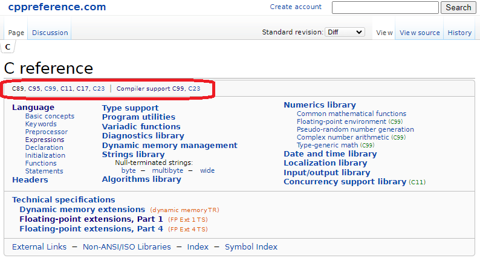

# Do it! C 언어 입문 - 김성엽
- 전반적으로 휼륭한 책입니다.

# 1.  프로그램과 C 언어
## 1-1. 프로그래밍 기초
## 1-2. C언어소개
## 1-3. 전자계산기 원리와 프로그래밍 개념
## 1-4. C언어 서술 형식
  ■ 주석문

   ```c
   /* 주석문은 /* 여러줄에 결쳐서도 */ 사용할 수 있습니다. */
   ```
  *Block주석은 사용하지 말 것*이며 Line 주석을 사용해야 한다.  
  - 위와 같은 문제가 발생하기도 하며,  
  - 찾기을 할 때도 Line 단위로 List Up 된다. (즉, 주석인지 아닌지 바로 확인불가)
  - 여러줄 주석처리 할때도 Editor의 Line Comment / UnComment 기능을 익혀서, 가급적 Line Comment한다.
    <https://github.com/zhangsob/Editor.html> 에서 Editor.html을 Down받아 Hot-Key을 익힌다.

  - 여러줄 주석처리하려면 확실하게.. 주석 시작 / 주석 끝을 표시한다.
  ```c
  /********************
  volatile int i = 0 ;
  for(i = 0; i < 1000; ++i)
      ; // Null Statement
  *********************/
  ```
  - 아래와 같이 전처리기로 ON (#if 1) / OFF(#if 0) 처리하는 것이 Test할 때 편리하다.
  ```c
  #if 0     // 의미 없는 것이라서 OFF처리함. 2024-01-01 전산과 부사수가
  volatile int i = 0 ;
  for(i = 0; i < 1000; ++i)
      ; // Null Statement
  #endif    // 의미 없는 부분이라서 주석처리함.
  ```
  - 부사수가 위와 같이 Off하니, 원작자인 사수가 다시 아래와 같이 Coding함.
  ```c
  #if 1     // [2024-08-04] 전자과 사수가 On한다. ("본 소스는 FirmWare 소스")
  volatile int i = 0 ;  // volatile은 compile에게 최적화할 때.
                        // 의미없다고 무시하지 말고, 그대로 수행하라고 하는 KeyWord
  for(i = 0; i < 1000; ++i)
      ; // Null Statement
  #else // OFF하면 Compile시 오류발생하도록 안전장치 추가
  #   error "FirmWare에서 Sleep을 주는 방법임.(위 부분 주석처리 금지)"
  #endif
  ```

## 1-5. C프로그램 실행 파일

# 2.  C언어로 만드는 첫 번째 프로그램
## 2-1. C언어 개발 환경 구축하기
## 2-2. 비주얼 스튜디오 프로젝트 만들기
## 2-3. 내가 만든 첫 번째 프로그램

# 3. 자료형
## 3-1. 컴퓨터의 자료 기억 방식
## 3-2. 문자를 숫자로 표현하는 약속, 아스키(ASCII) 코드
  - **KSC5601**
    > *ASCII* + 한글완성형(행정전상망)코드
    - 한글영역 : 0xB0A1 ~ 0xC8FE (2,350자)
    - 한글Space : 0xA1A1
    - 한글Ascii(횡배,전각) : 0xA3A1 ~ 0xA3FE (= 0xA380 + ASCII )
  - **EUC-KR** ( MS949, CodePage 949 )
    > *KSC5601* + "갂,..,똠,..,힣" [ (11,172 - 2350)자 추가 ]
  - Unicode ( **UTF-8**, UTF-16LE, UTF-16BE, UTF-32LE, UTF-32BE )
    > UCS2 : 전세계 주요 글자\
    > UCS4 : 모든 문자 (이모지, 고대 이집트 파피루스, 옛 한자...)\
    > UTF-8 (CodePage 65001), UTF-16LE, UTF-16BE, UTF-32LE, UTF-32BE
    - unicode chart 로 검색 (<https://www.unicode.org/charts/>)
    - 한글영역 : 0xAC00 ~ 0xD7A3 (초성x중성x종성 : 19 x 21 x 28 = 11,172자)
    - 자음,모음 : 0x3131 ~ 0x3163
    - 한글Space : 0x3000
    - 한글Ascii(횡배,전각) : 0xFF01 ~ 0xFF5E (= 0xFF00 + ASCII - 0x20 )
    - 점자 : 0x2800 ~ 0x28FF

  - 자료형과 charset
    |  자료형   |    charset     |
    |:---------:|----------------|
    | char[]    | EUC-KR, UTF-8  |
    | wchar_t[] | UTF-16, UTF-32 |

    *sizeof(wchar_t)가 2이면 UTF-16, 4이면 UTF-32*

  - cmd창에서 charset변경
    ```cmd
    > chcp
    > chcp 65001
    > chcp 949
    ```
    위에서 *>는 cmd창의 Prompt*를 뜻한다.

## 3-3. 자료형의 종류

# 4. 상수와 변수
## 4-1. 항상 같은 수, 상수
  | literal       |   자료형          |
  |:-------------:|-------------------|
  | 10, 010, 0xB0 | const int         |
  | "가"          | const char[]      |
  | '0'           | const char        |
  | 0.314         | const double      |
  | 0.314f        | const float       |
  | 0.314lL       | const long double |
  | L'가'         | const wchar_t     |
  | L"가나다"     | const wchar_t[]   |
  | 10L           | const long        |
  | 10LL          | const long long   |

  - <https://en.cppreference.com/w/c/language/integer_constant>\
    여기서, C99 : 1999년에 확정된 Spec, C23 : 2023년에 확정된 Spec
  - <https://en.cppreference.com/w/c/language/character_constant>
  - <https://en.cppreference.com/w/c/language/string_literal>
  - <https://en.cppreference.com/w/c> 에서..C언어 Version을 확인할 수 있다.\
    

## 4-2. 데이터 저장 공간, 변수
## 4-3. 2진수를 16진수로 변환하는 방법

# 5. 함수
## 5-1. C언어와 함수
## 5-2. 함수 정의하고, 호출하기
  ```c
  int sum(int value1, int value2)
  {
      int result = value1 + value2 ;
      return result ;
  }
  
  int main()
  {
     int a = 2, b = 3 ;
     int s = sum(a, b) ;
  }
  ```
  - 함수 Call & Return
  ```c
  int main()
  {
      int a = 2, b = 3 ;
      int s = sum(a, b) ;
      // int value1 = a ;
      // int value2 = b ;
      // ... Call 파라미터 순서대로 assign
      // int result = value1 + value2 ;
      // return result ;
      // ... Return Rvalue
      // int s = result ;
  }
  ```

## 5-3. main 함수 정리하기

  ```c
  #include <stdio.h>

  int main(int argc, char *argv[], char *envp[])
  {
      int i = 0 ;
      // 파라미터 얻기
      for(i = 0; i < argc; ++i)
          fprintf(stdout, "argv[%d] : %s\n", i, argv[i]) ;
      // 환경변수 얻기 [ char *getenv( const char *name ); ]
      for(i = 0; i < 100 ; ++i) {
          if(envp[i]) {
              fprintf(stderr, "envp[%d] : %s\n", i, envp[i]) ;
          }
          else
              break ;
      }
      return argc + i+1 ;
  }
  ```

- Call
  *Build하고 cmd창에서 아래와 같이 하자.* 
  ```command
  > test.exe 1 param2 "파라 3"
  > test.exe 1 param2 "파라 3" > stdout.txt
  > type stdout.txt
  > test.exe 1 param2 "파라 3" 2> stderr.txt
  > type stderr.txt
  > test.exe 1 param2 "파라 3" 1> log.txt 2>&1
  > type log.txt
  > test.exe 1 param2 "파라 3" >> log.txt 2>&1
  > type log.txt
  > test.exe 1 param2 "파라 3" 2> nul
  ```
  *2> 1> 1>> 2>&1* 에서 1은 stdout을 2은 stderr을 뜻 한다. [ 참고 0은 stdin ]\
  *2> 1> 1>> 2>&1* 에서 >는 redirect로 전달한다. >>는 Append한다\
  *nul* 은 nul로 보낸다. 즉, 버린다.

- Return
  ```command
  > test.exe 1 param2 "파라 3"
  > echo %errorlevel%
  ```
  위와 같이 *Windows Batch 프로그램* 할 수 있으며, Unix은 경우 Shell Script할 수 있다.

## 5-4. 함수 원형 선언하기

## 5-A. 함수 설명서 만들기
  - Java는 javadoc가 있다.
  ```java
  /**
   * 문자를 숫자로
   * @param s             숫자화할 문자열
   * @param radix         8: 8진수 10: 10진수, 16: 16진수
   * @param defaultVAlue  s가 ""이거나 null이거나 올바르지 않은 경우 기본값
   * @return              숫자
   */
  public static int parseInt(String s, int radix, int defaultValue) {
    ...
  }
  ```
  - Javascript도 JSDoc이 있다.
  - c(cpp)도 비슷한 것이 있다. [Doxygen](https://www.doxygen.nl/)
  ```c
  /// 문자를 숫자로 ("0" -> 0, "" -> defaultValue, "10원" --> 10)
  /// @param s             숫자화할 문자열
  /// @param size          문자열의 길이
  /// @param defaultVAlue  s가 ""이거나 null이거나 올바르지 않은 경우 기본값
  /// @return              숫자
  int a2i(char *s, int size, int defaultValue) {
      int i = 0, ret = 0 ;
      for(i = 0; i < size; ++i) {
          if('0' <= s[i] && s[i] <= '9')
              ret = ret * 10 + (s[i] - '0')
          else
              break ;
      }
      return (i == 0) ? defaultValue : ret ;
  }
  ```


# 6. 표준 출력 함수
## 6-1. 라이브러리
## 6-2. 라이브러리 사용 설명서, 헤더 파일
## 6-3. 전처리기
- 화일찾기
```cmd
> cd \
> dir stdio.h /s
```
## 6-4. 표준 라이브러리와 표준 출력 함수
## 6-5. 문자열 출력 함수 printf
- printf format string
- <https://cplusplus.com/reference/cstdio/printf/>
- <https://en.cppreference.com/w/c/io/c/fprintf>

# 7. 연산자
## 7-1. 기본 연산자
## 7-2. 연산자 우선순위와 연산 방향
- 우선순위 모호하면 무조건 ( ) 한다.
- 특히, bit 연산자 와 ? : 는 무조건 ( ) 하는 것이 좋다. [경험상]

# 8. 조건문
## 8-1. 제어문
## 8-2. if 조건문
- 참(true) : 0이 아님, 거짓(false) : 0임

■ c언어만 boolean형이 없다. (C23부터 생긴다.)
```c
if(!strcmp(str, "032"))   // 2000년이전 모니터가 640x480의 80 Column시절 Coding Style
    printf("인천(부천)\n") ;
if(strcmp(str, "034"))
    printf("개성공단이 아니다\n") ;
```
*!* 연산자는 눈에 잘 안보인다. 지양해야 할 것 ( *!* 은 부정적이다. )
```c
if(strcmp(str, "032") == 0)
    printf("인천(부천)\n") ;
if(strcmp(str, "034") != 0)
    printf("개성공단이 아니다\n") ;
```
*위와 같이 잘 보이게 한다. ( 긍정문을 사용하자! )*

■ =대입연산자와 ==관계연산자 혼동
```c
if(data = 3)  // if(data == 3)을 잘못 실수하여 data = 3 하였다. Run Time Error
if(3 == data) // 3 = data로 실수 하여도 Compile Time Error
```
- if(3 == data) // "if 3이 같다 data와"  읽기 불편하다.
- 즉, >=, <=, != 에 대하여도 위와 같이 하라는 뜻은 아닐 것이다.
- == 일때만 상수 == 변수로 하는 습관은 Safety Coding 방법이라는 뜻이다.
- Java에서도 아래와 같이 Safety Coding 방법이 있다.
```java
if(data.equal("string")) // data가 null 일때.. NullPointerException발생
if("string".equal(data)) // data가 null 일때.. false
```
그런데, 여기서 혼돈은 거의 없다. (실수일 뿐), 아래와 같을 때 혼돈이 발생한다.
```c
if(data==3)  // 왜 이분은 중국사람인가? 띄어쓰기를 안하네. 중국Programmer로 Coding할 때는 띄어쓰기한다.
if(data=3)   // 이분은 못배운 일본사람인가? 히라가나로만 글을 쓰네, 한자를 써서 의미전달를 확실해야야지.
```

■ 띄어쓰기 (예약어 및 2,3항 연산자은 반드시 양쪽 Spacing)
```c
if (data == 3)  // if while for else 예약어도 = == && || 연산자는 양쪽으로 Space하나로 띄어쓰기 한다.
if (data = 3)   // 띄어쓰기를 하면 = 가 단독으로 있는지 한눈에 보인다.
```

■ 띄어쓰기 (마침표를 뜻하는 ;도 Spacing)
```c
int data = 5;   // 국어선생님에 지적질을 많이 받아서.
if (data > 3);  // 줄끝에 ;를 아무생각없이 습관처럼 마침표를 찍었다.
    data++;     // 기호문자가 3자가 붙어 있다... 아휴..답답해.
```
아래와 같이 마침표도 ; 띄어 쓰기 한다면....
```c
int data = 5 ;    // 여기서, 시원시원해 보아지 않는가.
if (data > 3) ;   // 마침표가 확실히 잘 못 되었는지 확실히 보인다.
    ++data ;      // 우리는 시각적으로 [ 소문자 / 기호 / 숫자 / 대문자 / 한글 / WhiteSpace ]를 구분한다.
                  // data++; 를 ++data ; 로 시각적으로 읽기 좋다.
                  // C++ 아직 C언어이지요. ++C로 확실히 D언어로 하자..
```

■ 붙여쓰기
- 단항연산자 ++ -- ! ~ - + 전위 연산자로 앞쪽만 Spacing
- Separator(구분자) comma연산자 및 for문 안에 ; 뒤쪽만 Spacing
```c
int i = 0, j = 0, length = 0 ;
for (i = 0; i < length; ++i)
    ...
```

## 8-3. if ~ else ~ 조건문
## 8-4. 중첩된 if 조건문
  ```c
  #include <stdio.h>

  void main()
  {
      int score = 86 ;
      char grade ;

      if(score >= 90)      grade = 'A' ;  // 90점 이상
      else if(score >= 80) grade = 'B' ;  // 80점 이상
      else if(score >= 70) grade = 'C' ;  // 70점 이상
      else if(score >= 60) grade = 'D' ;  // 60점 이상
      else                 grade = 'F' ;  // 60점 미만

      printf("당신의 점수는 %d점이고, 등급은 %c입니다.\n", score, grade) ;
  }
  ```
  - 위와 같이 최대한 줄을 맞추어 작성한다.
  - 그러면, Editor에서 열 모드, Box 모드로 여러줄을 한번에 수정할 수 있다.
## 8-5. switch 조건문
  ```c
  #include <stdio.h>

  void main()
  {
      int score = 86 ;
      char grade ;

      switch(scroe / 10)
      {
      case 10 : grade = 'A' ; break ;
      case  9 : grade = 'A' ; break ;
      case  8 : grade = 'B' ; break ;
      case  7 : grade = 'C' ; break ;
      case  6 : grade = 'D' ; break ;
      default : grade = 'F' ; break ;
      }
      
      printf("당신의 점수는 %d점이고, 등급은 %c입니다.\n", score, grade) ;
  }
  ```

  ```c
  #include <stdio.h>

  char grade(int score)
  {
      switch(scroe / 10)
      {
      case 10 : return 'A' ;
      case  9 : return 'A' ;
      case  8 : return 'B' ;
      case  7 : return 'C' ;
      case  6 : return 'D' ;
      default : return 'F' ;
      }
  }

  void main()
  {
      int score = 86 ;
      
      printf("당신의 점수는 %d점이고, 등급은 %c입니다.\n", score, grade(score)) ;
  }
  ```
  | score | grade |
  |:------|:-----:|
  | 90 ~  | A     |
  | 80 ~  | B     |
  | 70 ~  | C     |
  | 60 ~  | D     |
  | ~ 59  | F     |
  
  *위 3가지 소스가 모두 위 표를 보는 듯한 Code이다.*

# 9. 반복문
## 9-1. 반복문의 기본 구조와 for반복문
## 9-2. while 반복문
## 9-3. 반복문 구성 방법
## 9-4. 중첩 반복문
## 9-5. break와 continue 제어문

# 10. 시프트 연산자와 비트 연산자
## 10-1. 비트단위 연산과 비트 패턴
## 10-2. 시프트 연산자
## 10-3. 비트 연산자

# 11. 지역 변수와 전역변수
## 11-1. 함수 안에서만 사용하는 지역변수
## 11-2. 프로그램 전체에서 사용할 수 있는 전역변수
## 11-3. extern 키워드
## 11-4. static 키워드

    register int  
    volatile int  
    auto int  

    const int, const char *  

    > auto   : 블럭안 / 함수안 / 함수밖(전역) 변수  
    > static : 함수안에서만 / 화일안에서만 상주하는 변수  
    > extern : 화일밖에 변수  

    ```c
    if(A > 2) {
        if(A < 10)
            A++ ;
    }
    ```
    ```c
    if(A > 2 && A < 10) A++ ;
    ```
    ```c
    if(2 < A && A < 10) A++ ;
    ```

    ```c
    int isLitteEndian() {
        union {
            short si ;
            char ch[2] ;
        }
        ch[0] = 0x01 ;
        ch[1] = 0x00 ;
        return (si == 1) ;
    }
    ```

# 12. 배열과 문자열
## 12-1. 배열
## 12-2. 문자열
## 12-3. 2차원배열

# 13. 포인터
## 13-1. 운영체제의 메모리 관리 방식
## 13-2. 포인터
## 13-3. 포인터와 const 키워드
## 13-4. 포인터 변수의 주소 연산
    ```c
    {
        char name[10] = "name" ;	// name의 type "char * const" 이다.
        char *p = name ;
        printf("p = %p, name = %p\n", p, name) ;
        p = p + 3 ;
        printf("p = %p, name = %p\n", p, name) ;
        name = p + 3 ;  // Error
        p = name + 3 ;  // OK
    }
    {
        short name[10] = { 0, 1, 2, 3 } ;	// name의 type "short * const" 이다.
        short *p = name ;
        printf("p = %p, name = %p\n", p, name) ;
        p = p + 3 ;
        printf("p = %p, name = %p, &name[0] = %p\n", p, name, &name[0]) ;   // name == &name[0]
        printf("p = %p, &name[3] = %p, (name+3) = %p\n", p, &name[3], name+3) ;
    }
    ```
## 13-5. 포인터와 대상의 크기
## 13-6. void *형 포인터
  - void* memset( void* dest, int ch, std::size_t count );
  - void* memcpy( void* dest, const void* src, std::size_t count );
  - int memcmp( const void* lhs, const void* rhs, std::size_t count );

# 14. 표준 입력 함수
## 14-1. 표준 입력 함수
## 14-3. 문자열을 정수로 변환하기
  - int atoi( const char *str );    // <https://en.cppreference.com/w/c/string/byte/atoi>
  ```c
  /// 십진수 문자열을 숫자로
  /// @param str    문자열
  /// @param len    대상길이
  /// @return       값
  int a2i(const char str[], int len)
  {
      int ret = 0, i = 0 ;
      for(i = 0; i < len; ++i) {
          if('0' <= str[i] && str[i] <= '9')
              ret = ret * 10 + (str[i] - '0') ;
          else
              break ;
      }
      return ret ;
  }
  ```
## 14-4. 표준 입력 함수 scanf

# 15. 배열과 포인터
## 15-1. 배열과 포인터 표기법
## 15-2. 배열 시작 주소
## 15-3. 배열을 사용하는 포인터
## 15-4. 배열과 포인터의 합체

# 16. 메모리 할당
## 16-1. 프로세스와 메모리 할당
## 16-2. 지역변수와 스택
## 16-3. 동적 메모리 할당 및 해제
## 16-4. 동적 메모리 사용하기

# 17. 다차원 포인터
## 17-1. 다차원 포인터 개념
## 17-2. 2차원 포인터
## 17-3. 2차원 포인터와 함수의 매개변수
## 17-4. 2차원 포인터와 2차원 배열

# 18. 구조체와 연결리스트
## 18-1. typedef 문법
## 18-2. 데이터를 구룹으로 묶는 구조체
## 18-3. 배열과 구조체
## 18-4. 구조체로 만든 자료형의 크기
  - #pragma pack(push)  
  - #pragma pack(1)  
  - #pragma pack(pop)  
## 18-5. 구조체로 활용한 연결 리스트
  - linked list (직접 구현할 일 없음.. 그리고, 위험함.)
  - CPP의 STL을 사용하는 것이 바람직함.

# 19. 파일 입출력
## 19-1. 표준 입출력 라이브러리
## 19-2. Text File과 Binary File
  - Magic Number

## 19-3. 파열 열기와 닫기
## 19-4. Text 파일에 데이터 읽고 쓰기
## 19-5. Binary 파일에 테이터 읽고 쓰기

# 20. 함수포인터
## 20-1. 함수포인터
## 20-2. 함수 그룹
## 20-3. 콜백 함수

# A. 동적라이브러리
  - Static Link
  - Dynamic Link

# B. 다른 언어어 C함수 호출하기
  - Deplphi, PowerBuilder, C# : DLL
  - Java : JNI
  - Node : napi
  - Browser : webasm
